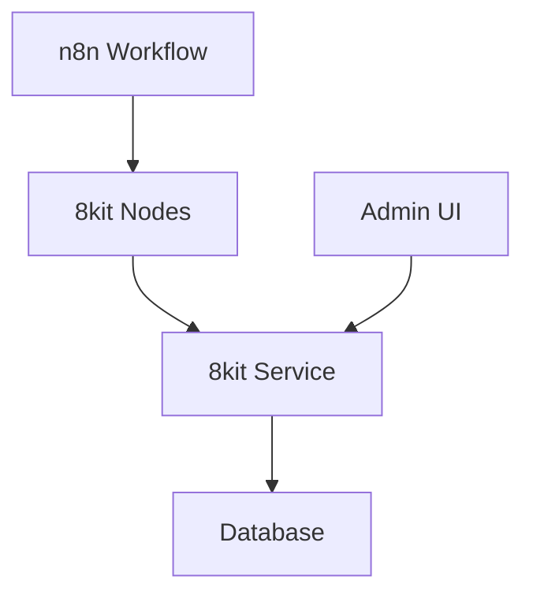

<div align="center">


**The missing toolkit for n8n workflows**

[](https://opensource.org/licenses/Apache-2.0)
[](https://discord.com/invite/NR8eTfHX)
[](https://github.com/orgs/8kit-io)

*Build reliable, idempotent, and traceable automations with n8n*

</div>

---

## 🚀 What is 8kit?

8kit is a comprehensive toolkit designed to solve the most common challenges in n8n workflow automation. Born from real-world integration experience, it provides the missing pieces for production-ready workflows.

### The Problem We Solve

When connecting multiple systems with n8n, you quickly face these challenges:
- **Duplicate Processing** - Orders processed twice, data sent multiple times
- **ID Mapping** - Different systems use different identifiers
- **State Management** - No way to track what's already been processed
- **API Overload** - Unnecessary calls and inefficient data handling

### Our Solution

8kit provides three core components that work together:

<table>
<tr>
<td width="33%">

**🔧 8kit Service**
*Core API Layer*

- Set tracking and management
- Bi-directional ID mapping
- State management and locks
- Bulk operations support

[📦 View Repository](https://github.com/8kit-io/service-8kit-community)

</td>
<td width="33%">

**🧩 n8n Nodes**
*Custom Workflow Nodes*

- Pre-built nodes for common operations
- Seamless integration with 8kit service
- Easy-to-use interface
- Comprehensive error handling

[📦 View Repository](https://github.com/8kit-io/n8n-node-8kit-community)

</td>
<td width="33%">

**🖥️ Admin UI**
*Management Dashboard*

- Visual monitoring interface
- Configuration management
- Usage analytics

[📦 View Repository](https://github.com/8kit-io/ui-8kit-community)

</td>
</tr>
</table>

---

## ⚡ Quick Start

Get up and running with 8kit in minutes:

```bash
# Clone the service repository
git clone https://github.com/8kit-io/service-8kit-community.git
cd service-8kit-community

# Start with Docker Compose
docker-compose up -d

# Install n8n nodes
npm install @8kit/n8n-nodes

# Access admin UI
open http://localhost:3000
```

## 🎯 Perfect For

- **E-commerce Integrations** - Order sync between Shopify, ERP, and fulfillment
- **Data Synchronization** - Keep multiple systems in sync reliably
- **API Orchestration** - Manage complex multi-system workflows
- **Stateful Workflows** - Track and manage workflow state across executions

## 🌟 Key Features

- ✅ **Idempotent Operations** - Never process the same data twice
- ✅ **Bi-directional ID Mapping** - Seamlessly map IDs between systems
- ✅ **State Management** - Track what's been processed with locks and sets
- ✅ **Bulk Operations** - Process up to 1000 items efficiently
- ✅ **Multi-tenant Support** - Isolated data per application
- ✅ **Admin Dashboard** - Visual monitoring and management
- ✅ **Docker Ready** - Easy deployment and scaling

## 🛠️ Architecture



## 📚 Documentation

- 📖 [Complete Documentation](https://8kit.io/docs)
- 🚀 [Getting Started Guide](https://8kit.io/docs/getting-started/self-hosting-docker-compose)
- 🎓 [Hello World Tutorial](https://8kit.io/docs/getting-started/hello-world/print-hello-world-once)
- 🔧 [API Reference](https://8kit.io/docs/api/authentication)

## 🤝 Community & Support

- 💬 [Discord Community](https://discord.com/invite/NR8eTfHX) - Chat with other users and get help
- 🐛 [Report Issues](https://github.com/8kit-io/service-8kit-community/issues) - Found a bug? Let us know!
- 💡 [Request Features](https://github.com/8kit-io/service-8kit-community/discussions) - Have an idea? We'd love to hear it!
- 📝 [Contribute](https://github.com/8kit-io/service-8kit-community/blob/main/CONTRIBUTING.md) - Help us improve 8kit

## 📄 License

8kit is licensed under the Apache License, Version 2.0 with Additional Use Restrictions. See our [Sustainable License](https://8kit.io/sustainable-license) for details.

**Permitted Uses:**
- ✅ Internal business use
- ✅ Personal projects and education
- ✅ Consulting services for client self-hosting

**Commercial Use:** Requires a commercial license from [Digital Stratagems Limited](mailto:hello@8kit.io)

## 🏢 About

Built with ❤️ by [**STRATAGEMS**](https://stratagems.com) for the n8n community.

We've spent years helping retailers connect their core systems and built 8kit to solve the recurring challenges we faced. Now we're sharing it with the community to make n8n workflows production-ready for everyone.

---

<div align="center">

**Ready to build bulletproof automations?**

[🚀 Get Started](https://8kit.io/docs) • [💬 Join Discord](https://discord.com/invite/NR8eTfHX) • [⭐ Star Us](https://github.com/8kit-io/service-8kit-community)

</div>
